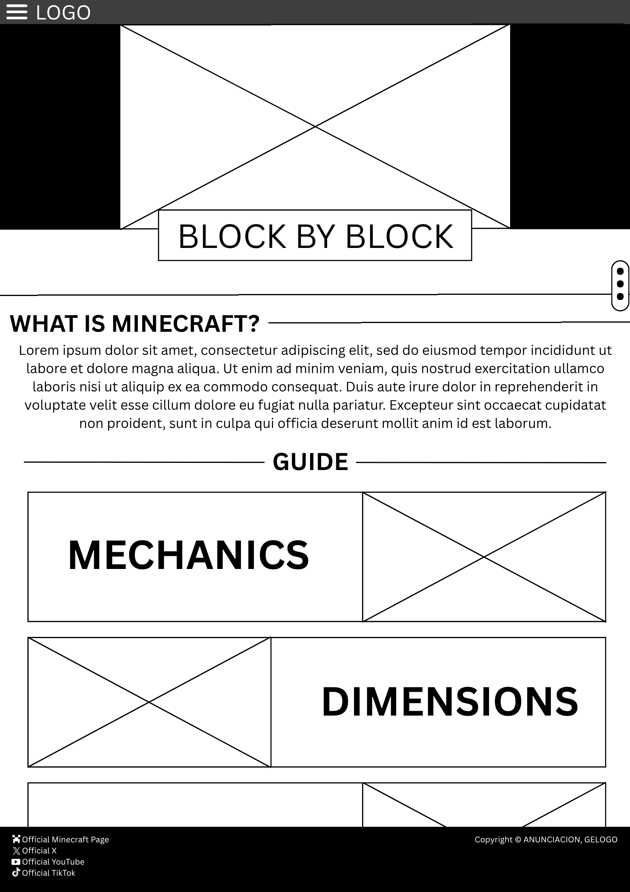
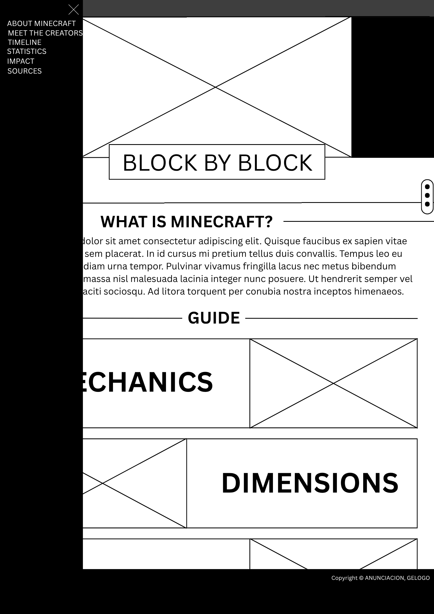
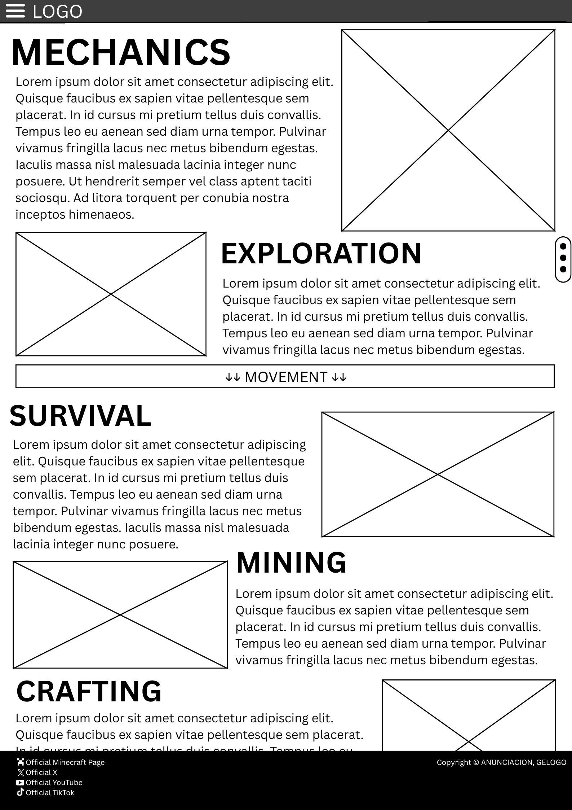
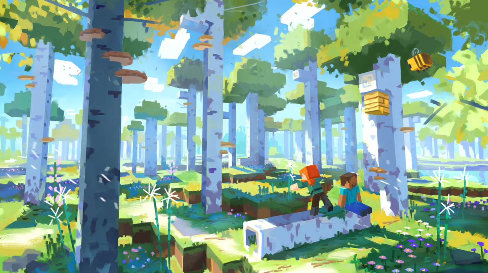
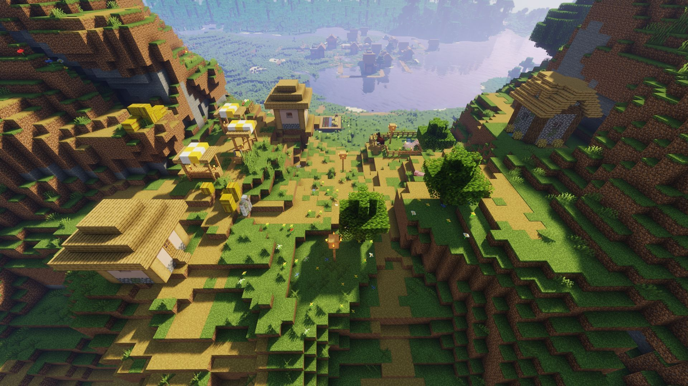
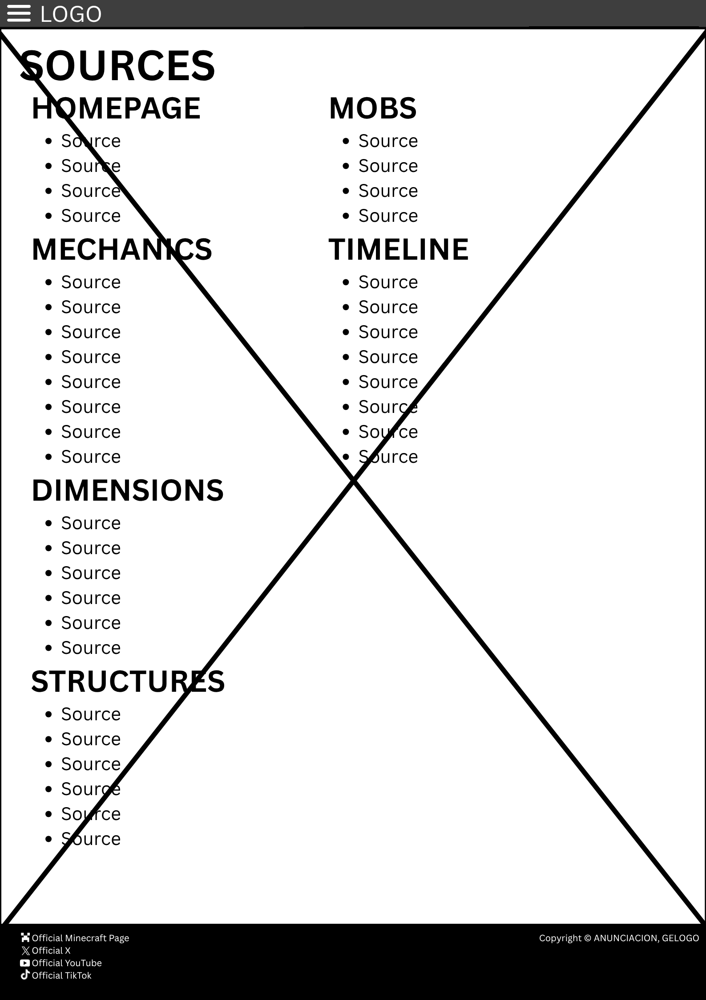

# CS3WDProjCesiumAnunciacionGelogo
## Logo:

---
### Description
#### Block by Block is an informational website that introduces visitors to the world of Minecraft — the creative sandbox game loved by millions around the world.
This website explains what Minecraft is, how it works, and why it’s so popular. Users can learn about the game’s history, versions, and gameplay features. They will be able to learn the necessary information to play Minecraft and explore its vast world.
Whether you are a beginner or just curious, Block by Block gives you everything you need to know about Minecraft in one place.
---
# Breakdown
## Home/Front Page
### This page will contain a short introduction to Minecraft, as well as serving as a menu to go to the rest of the webpages.
## Mechanics
### This page will teach users the core mechanics of Minecraft, from movement to survival to crafting, mining, and combat. 
## Dimensions
### This page will show the three different dimensions of Minecraft — the Overworld, the Nether, and the End — and the various biomes in each one. Additional information such as biome-exclusive mobs will also be included.
## Structures
### This page will present the various structures that appear within Minecraft and describe them. Details such as key features, loot, and the biome/s they spawn in are also included, as well as any potentially unique information about the structures.
## Mobs
### This page will classify mobs into their types — passive, neutral, and hostile — and add a description for each type of mob, listing every single one according to their classification. Variants such as the husk (zombie) and stray (skeleton) will also be included.
## Timeline
### This page will trace the history of Minecraft and its development from beginning to end, starting from the early alpha to present day. Users will be able to learn how the game changed version by version, with detailed information hidden in expanding panels.
## Sources
### This page will include all of the sources. The sources will be divided according to the webpage that their information was cited in.
---
# JavaScript use:
### JavaScript will be utilized on the website to create interactive elements such as expandable and collapsible panels that reveal additional information. Examples include the hamburger menu, which displays various links when clicked, and accordions that expand downward to provide more detailed content.
---
### Notes:
* The down arrows ↓↓ indicates an accordion, a panel that expands downwards when clicked. This will provide additional information on the topic the accordion is attached to.
* The vertical ellipsis ⋮ represents a scroll button. This indicates that there is more information further down that cannot be visualized by a wire frame due to the limited size.
* The hamburger menu ☰ indicates the menu. When clicked, a panel will slide from the left side of the screen, providing more links. These links are miscellaneous, and only provide extra information, as most information in these links are not important to learning more about Minecraft (ex. Statistics or Meet the Creators)
---
### Home Page

### Home Page (Expanded)

### First Page — Mechanics

### Second Page — Dimensions

### Third Page — Structures

### Fourth Page — Sources

