# CS3WDProjCesiumAnunciacionGelogo
## Logo:

---
### Description
#### Block by Block is an informational website that introduces visitors to the world of Minecraft — the creative sandbox game loved by millions around the world.
#### This website explains what Minecraft is, how it works, and why it’s so popular. Users can learn about the game’s history, versions, and gameplay features. They will be able to learn the necessary information to play Minecraft and explore its vast world.
#### Whether you are a beginner or just curious, Block by Block gives you everything you need to know about Minecraft in one place.
---
# Breakdown
## Home/Front Page
### This page will contain a short introduction to Minecraft, as well as serving as a menu to go to the rest of the webpages.
## Mechanics    
### This page will teach users the core mechanics of Minecraft, from movement to survival to crafting, mining, and combat. 
## Dimensions
### This page will show the three different dimensions of Minecraft — the Overworld, the Nether, and the End — and the various biomes in each one. Additional information such as biome-exclusive mobs will also be included.
## Structures
### This page will present the various structures that appear within Minecraft and describe them. Details such as key features, loot, and the biome/s they spawn in are also included, as well as any potentially unique information about the structures.
## Mobs
### This page will classify mobs into their types — passive, neutral, and hostile — and add a description for each type of mob, listing every single one according to their classification. Variants such as the husk (zombie) and stray (skeleton) will also be included.
## Timeline
### This page will trace the history of Minecraft and its development from beginning to end, starting from the early alpha to present day. Users will be able to learn how the game changed version by version, with detailed information hidden in expanding panels.
## Sources
### This page will include all of the sources. The sources will be divided according to the webpage that their information was cited in.
## Login
### This page will request for your login information, specifically your password and email. If an account with that email and password already exists, it will automatically log in, and if it is completely new to the website, the users will be prompted if they want to register. If the email does not exist, the user will be informed as such, and will not be allowed to log in. If the password is incorrect, the same will happen.
## Profile Customization
### This page will allow users to customize their profile using the data gathered from the login page. Users will be able to choose a username, display name, and a profile picture. Through this page, one will be able to customize their preferences for the forum page, allowing them to only see content of that category.
## Forums
### This page will allow users to communicate to others through threads and comments. They will be able to ask questions regarding Minecraft, whether it's a tip in PvP, building a house, how to fix a redstone contraption, etc., and they will be able to answer such questions to their ability. Threads will be compressed at first, only expanding downwards to provide more information once clicked.
---
# JavaScript use:
### JavaScript will be utilized on the website to create interactive elements such as expandable and collapsible panels that reveal additional information. Examples include the hamburger menu, which displays various links when clicked, and accordions that expand downward to provide more detailed content.
---
# FINAL MODIFICATION PROPOSAL
---
## Design and Narrative
### Purpose
The last change of Block by Block is the implementation of Full CRUD (Create, Read, Update, Delete) with the help of localStorage. This enables the site to cross over into the domain of being purely informational and be an interactive site in which users are able to control their own information.
---
### How It Will Be Used
#### Create (C)
The Login page requires the user to input his/her data (email, username, display name, gender). This data is stored to the local storage.
#### Read (R)
The data stored is accessed and presented in:
- The user display (username) in the navigation bar.
- The profile preview section
- Other pages of the site such as the forums page.
#### Update (U)
In the Profile Customization page, users are allowed to update their profile information. After saving, the revised data is stored and then replaces the earlier data in the localStorage.
#### Delete (D)
Aside from a log out button, the profile preview section on the top right hand side of the website sports a delete account button, which triggers a confirmation pup-up when pressed before then deleting the account if confirmed.
---
## Updated Design / Features
### Login Page (Updated)
User input is now stored in the local storage of the login page. It also traces the presence of a user in the system with the help of a stored flag.
---
In this version, the user is able to customize the profile by selecting additional background colors and additional features that suit their taste and needs (Myspace, 2009).<|human|>Profile Customization Page (Revised) In this version, the user can customize the profile by using more background color options and more features that fits the taste and needs (Myspace, 2009).
---
## Wireframe Updates
We plan on modifying the website to have an actual profile preview section on the top right hand side of every single website. Upon clicking the profile section in the navigation bar, a panel will drop, featuring information such as the profile preview (which includes the profile picture, username, display name, and pronouns) as well as a selection of the previously created accounts (if any), which allows users to quickly switch between accounts. This panel also features a log out and delete button, which sends the users back to the sign-in page.
---
## JavaScript Implementation
The following is used to implement the CRUD system:
#### Create / Update
`localStorage.setItem()`
#### Read
`localStorage.getItem()`
#### Delete
`localStorage.removeItem()`
---
### JavaScript is also used to:
- Change the preview of the profile dynamically.
- Match form entries with records.
- Monitor access to and exit of users.
- Manage page redirection
### Notes:
* The down arrows ↓↓ indicates an accordion, a panel that expands downwards when clicked. This will provide additional information on the topic the accordion is attached to.
* The vertical ellipsis ⋮ represents a scroll button. This indicates that there is more information further down that cannot be visualized by a wire frame due to the limited size.
* The hamburger menu ☰ indicates the menu. When clicked, a panel will slide from the left side of the screen, providing more links. These links are miscellaneous, and only provide extra information, as most information in these links are not important to learning more about Minecraft (ex. Statistics or Meet the Creators)
---
### Home Page
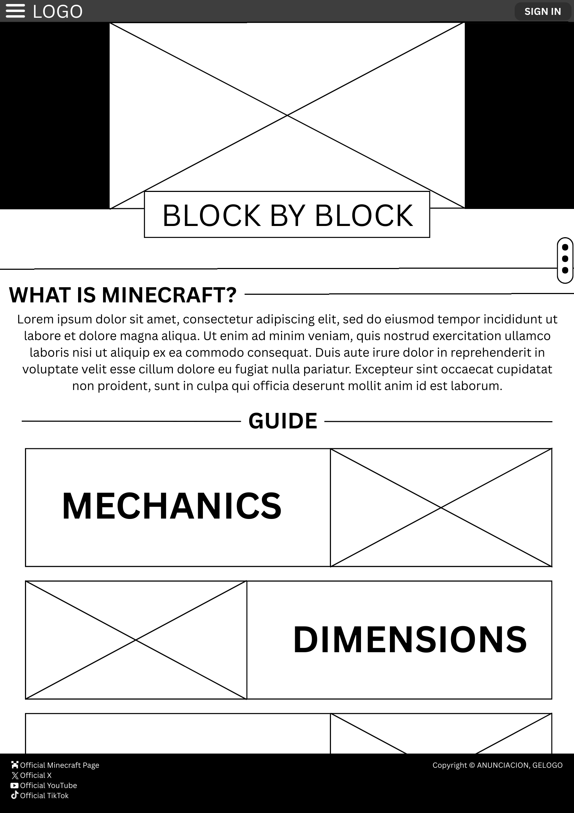
### Home Page (Expanded)
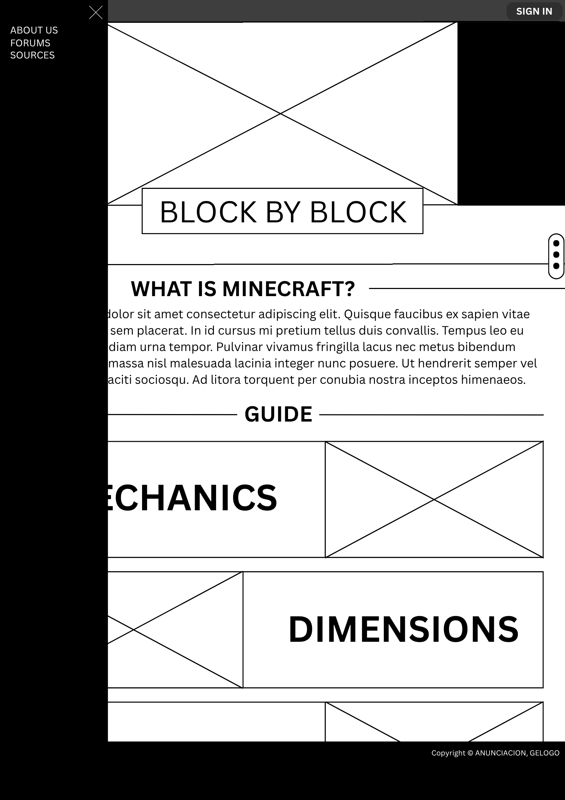
### Home Page (Expanded — with Profile)
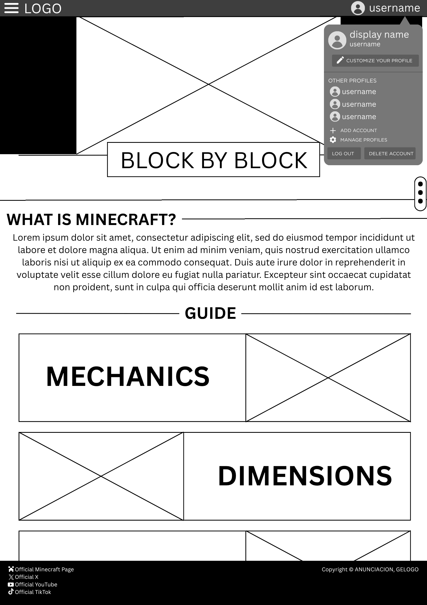
### First Page — Mechanics
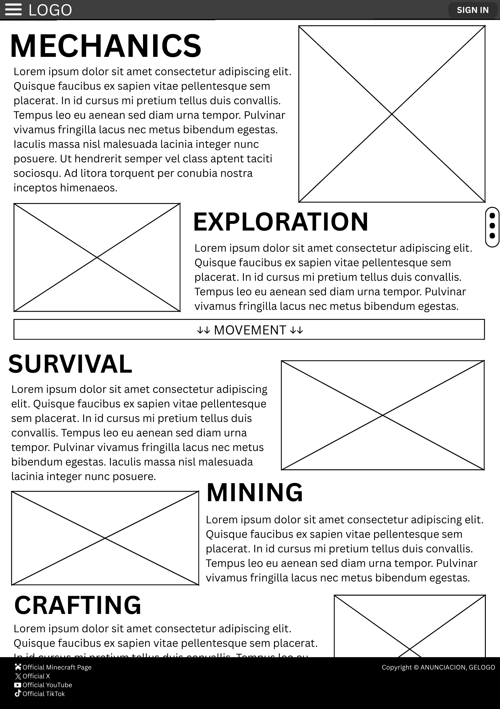
### Second Page — Dimensions
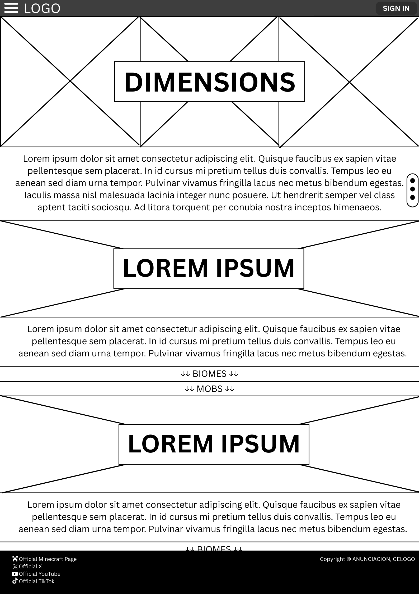
### Third Page — Structures
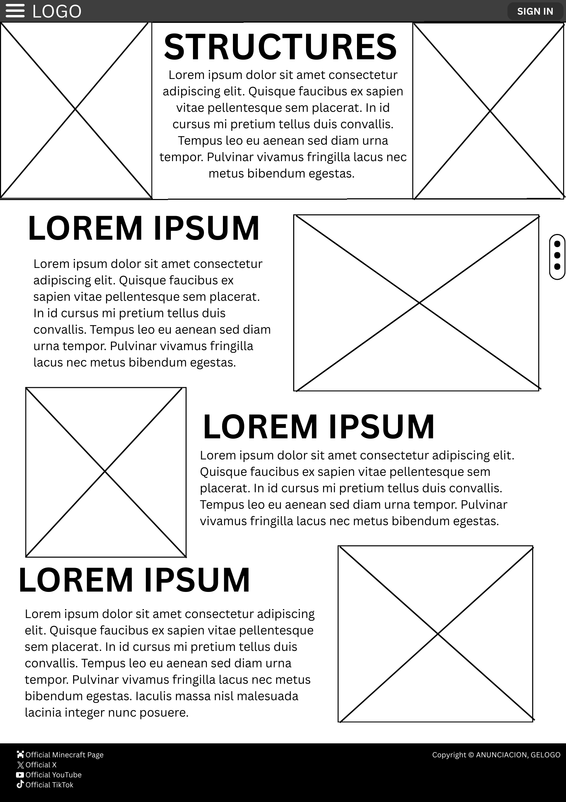
### Fourth Page — Sources
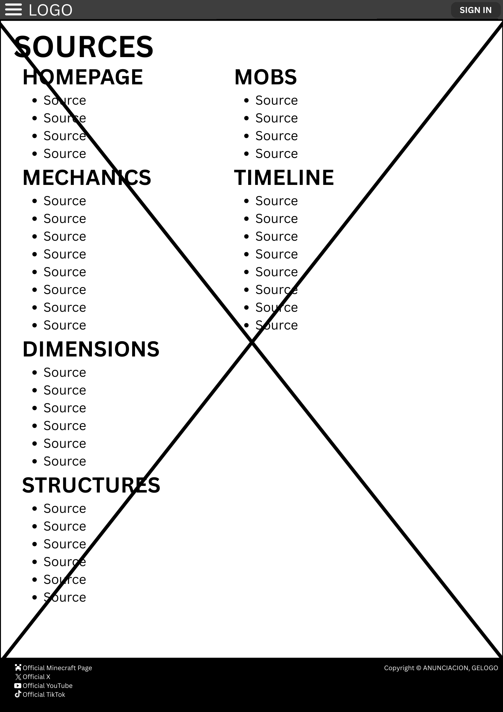
### Fifth Page — Login 
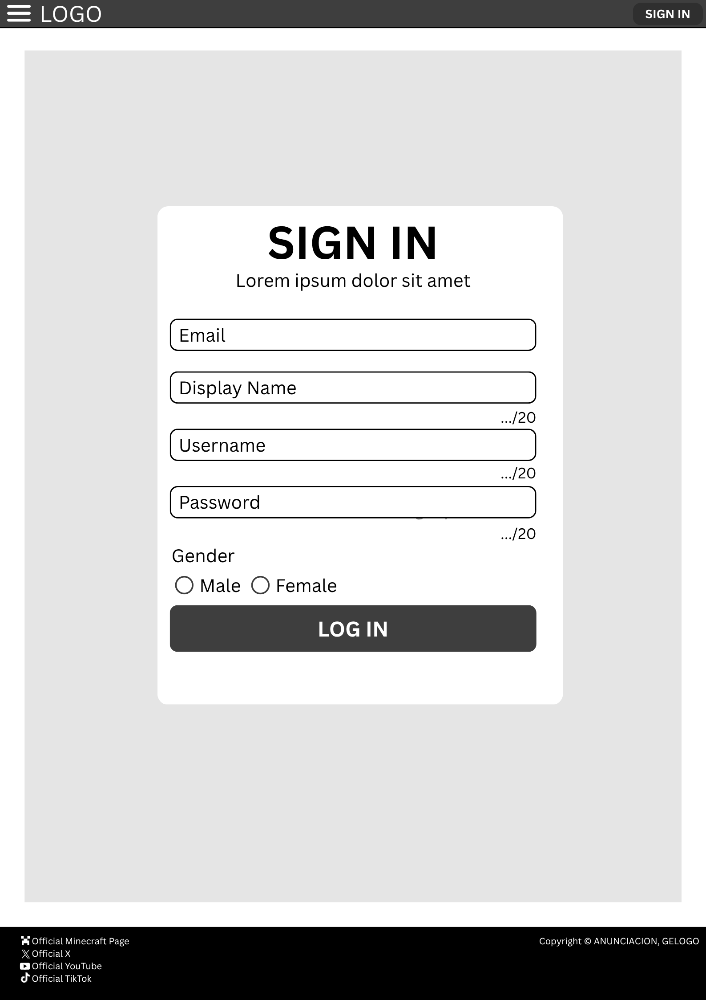
### Sixth Page — Profile Customization
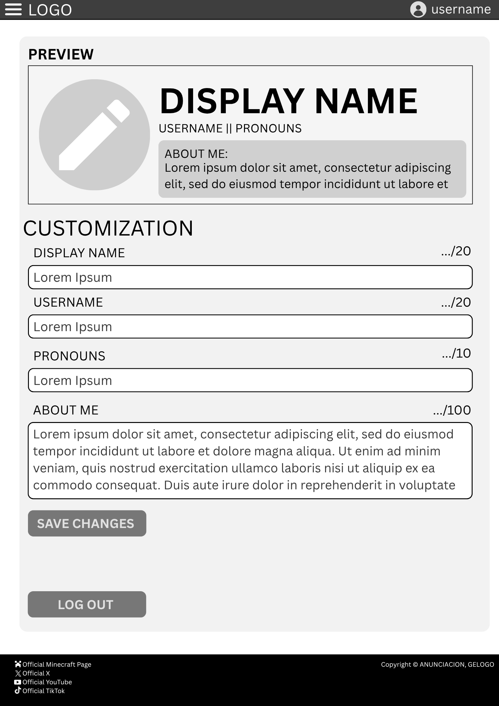
### Seventh Page — Forums
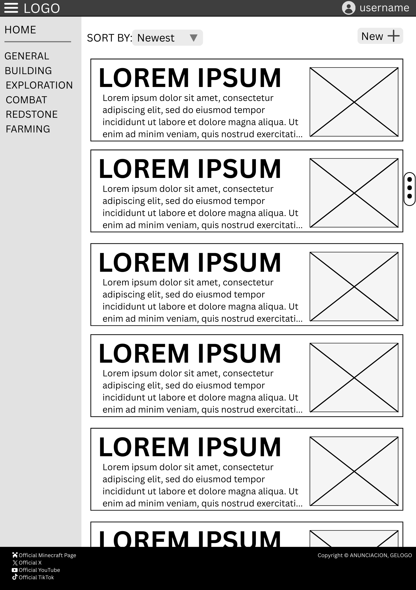
### Seventh Page — Forums (Expanded)
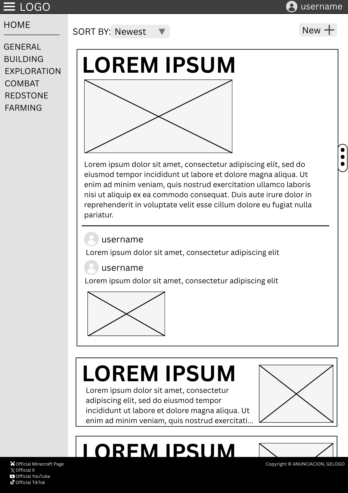